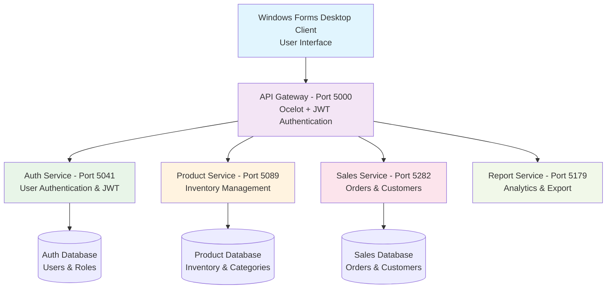
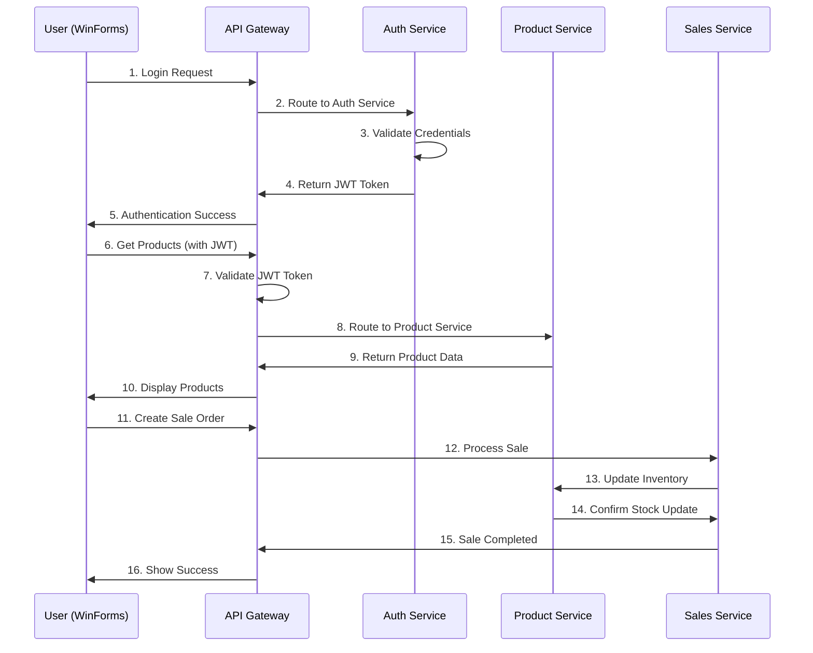
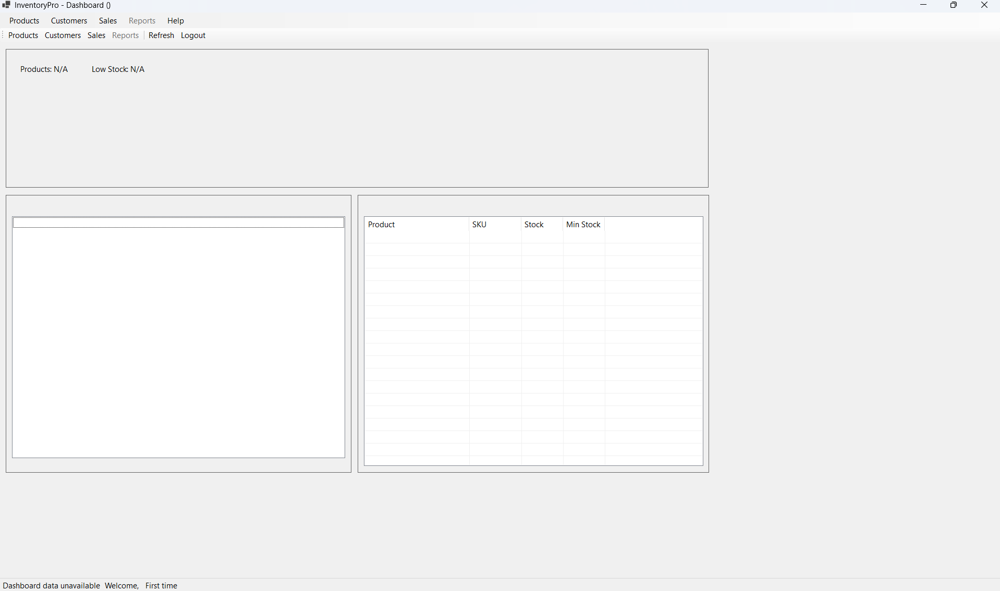

# 🏪 InventoryPro - Academic Presentation Guide
*A Complete Microservices-Based Inventory Management System*

---

## 📋 Project Title & Overview

### **Project Title**
**InventoryPro** - Enterprise-Grade Inventory Management System with Microservices Architecture

### **Core Purpose & Innovation**
InventoryPro demonstrates modern software development practices through a **complete business solution** that manages inventory, sales, and customer relationships. The project showcases:

- **Microservices Architecture** - Breaking complex systems into independent, scalable services
- **API Gateway Pattern** - Centralized request routing and cross-cutting concerns  
- **JWT Authentication** - Secure, stateless authentication across distributed services
- **Modern .NET 9.0** - Latest framework features and best practices
- **Enterprise Patterns** - Real-world architectural decisions used in production systems

**Problem Solved:** Traditional monolithic inventory systems are difficult to scale and maintain. This project demonstrates how to build scalable, maintainable business applications using modern architectural patterns.

---

## 🏗️ Visualization & Diagrams

### **System Architecture Diagram**



### **Workflow Diagram - User Journey**



### **UI Screenshots with Annotations**



**Key UI Features:**
- **Dashboard** - Real-time statistics and navigation hub
- **Product Grid** - Inventory management with stock alerts
- **Sales Interface** - Point-of-sale functionality
- **Customer Management** - Complete customer profiles
- **Reports** - Business analytics with export capabilities

---

## 🔧 Key Components

### **Front-End: Windows Forms Desktop Application**

**Technologies Used:**
- **.NET 9.0 Windows Forms** - Modern desktop UI framework
- **Dependency Injection** - Service-oriented architecture
- **HttpClient with Polly** - Resilient API communication
- **Async/Await Patterns** - Non-blocking operations

**Key Features:**
- Rich desktop user interface with modern styling
- Real-time data updates and notifications
- Responsive design with proper error handling
- JWT token management and automatic refresh
- Form validation and user feedback

### **Back-End: Microservices Architecture**

**Framework & Technologies:**
- **ASP.NET Core 9.0** - High-performance web APIs
- **Entity Framework Core** - Modern ORM with migrations
- **Ocelot API Gateway** - Request routing and authentication
- **Serilog** - Structured logging across all services
- **BCrypt** - Secure password hashing

**Core Services:**

#### 1. **Authentication Service** (Port 5041)
- User login and registration
- JWT token generation and validation
- Password hashing with BCrypt
- Role-based access control

#### 2. **Product Service** (Port 5089)
- Complete product lifecycle management
- SKU and barcode support
- Category organization
- Stock level tracking and alerts
- Search and pagination

#### 3. **Sales Service** (Port 5282)
- Sales order processing
- Customer relationship management
- Invoice generation
- Real-time inventory updates
- Payment tracking

#### 4. **Report Service** (Port 5179)
- Business analytics and reporting
- Data export (PDF, Excel, CSV)
- Chart generation
- Financial summaries
- Custom report builders

#### 5. **API Gateway** (Port 5000)
- Single entry point for all requests
- JWT authentication validation
- Rate limiting (100 requests/minute)
- Request routing to appropriate services
- Cross-cutting concerns (logging, monitoring)

### **Database: Multi-Database Architecture**

**Database Design:**
- **Database-per-Service Pattern** - Each service owns its data
- **SQL Server** - Enterprise-grade relational database
- **Entity Framework Migrations** - Version-controlled schema changes

**Database Schema:**

```sql
-- Auth Database
Users: Id, Username, PasswordHash, Role, CreatedAt
UserSessions: Id, UserId, Token, ExpiresAt

-- Product Database  
Products: Id, Name, SKU, Description, Price, StockQuantity, MinimumStock
Categories: Id, Name, Description
ProductCategories: ProductId, CategoryId

-- Sales Database
Sales: Id, CustomerId, TotalAmount, SaleDate, TaxAmount
SaleItems: Id, SaleId, ProductId, Quantity, UnitPrice
Customers: Id, Name, Email, Phone, Address
```

**Sample Queries:**
```sql
-- Get low stock products
SELECT p.Name, p.SKU, p.StockQuantity, p.MinimumStock
FROM Products p 
WHERE p.StockQuantity <= p.MinimumStock;

-- Monthly sales summary
SELECT MONTH(s.SaleDate) as Month, 
       SUM(s.TotalAmount) as Revenue,
       COUNT(*) as OrderCount
FROM Sales s 
WHERE YEAR(s.SaleDate) = 2024
GROUP BY MONTH(s.SaleDate);
```

---

## 🔄 Workflow Explanation

### **Step-by-Step System Operation**

#### **1. User Authentication Flow**
1. **User Input** → Username/password entered in WinForms login
2. **API Call** → Credentials sent to Gateway → Auth Service
3. **Validation** → BCrypt password verification against database
4. **Token Generation** → JWT token created with user claims
5. **Client Storage** → Token stored securely for subsequent requests

#### **2. Product Management Workflow**
1. **Data Request** → Client requests products via Gateway
2. **Authentication** → Gateway validates JWT Token
3. **Service Routing** → Request routed to Product Service
4. **Database Query** → EF Core retrieves data with pagination
5. **Response** → JSON data returned through Gateway to client
6. **UI Update** → WinForms displays data in grid with search/filter

#### **3. Sales Processing Workflow**
1. **Order Creation** → User selects products and customer
2. **Inventory Check** → Real-time stock validation
3. **Transaction Processing** → Sale record created in database
4. **Inventory Update** → Product quantities automatically reduced
5. **Invoice Generation** → PDF invoice created and saved
6. **Customer Update** → Purchase history updated

### **Error Handling & Resilience**
- **Circuit Breaker Pattern** - Prevents cascade failures
- **Retry Policies** - Automatic retry with exponential backoff
- **Graceful Degradation** - System continues operating with reduced functionality
- **Comprehensive Logging** - All errors tracked and logged
- **User Feedback** - Clear error messages and recovery guidance

### **Performance Optimizations**
- **Async Operations** - Non-blocking database and API calls
- **Connection Pooling** - Efficient database connection management
- **Caching Strategies** - Frequently accessed data cached
- **Pagination** - Large datasets loaded incrementally
- **Lazy Loading** - Related data loaded on demand

---

## 🎯 Demo & Core Importance

### **System's Unique Value**

#### **1. Educational Excellence**
- **Real-World Architecture** - Patterns used in enterprise applications
- **Modern Technology Stack** - Latest .NET 9.0 and best practices
- **Complete Implementation** - Not just a prototype, but fully functional
- **Scalable Design** - Can handle production workloads

#### **2. Technical Innovation**
- **Microservices Mastery** - Proper service decomposition and communication
- **Security Focus** - JWT authentication with proper validation
- **Resilience Patterns** - Circuit breakers, retries, and graceful failures
- **Clean Architecture** - Separation of concerns and dependency injection

#### **3. Business Value**
- **Complete Solution** - Handles entire inventory management lifecycle
- **User Experience** - Intuitive desktop interface with real-time updates
- **Data Integrity** - Proper transaction handling and validation
- **Reporting Capabilities** - Business intelligence and analytics

### **Demo Script**

#### **5-Minute Core Demo**

1. **Authentication (30 seconds)**
   - Show login screen
   - Demonstrate invalid credentials → error handling
   - Successful login → JWT token received

2. **Dashboard Overview (1 minute)**
   - Real-time statistics display
   - Navigation to different modules
   - System health indicators

3. **Product Management (1.5 minutes)**
   - Add new product with validation
   - Search and filter functionality
   - Stock level alerts demonstration
   - Edit/delete operations

4. **Sales Processing (1.5 minutes)**
   - Create new sale order
   - Select customer and products
   - Real-time inventory updates
   - Generate and view invoice

5. **Reporting & Analytics (30 seconds)**
   - Generate sales report
   - Export to PDF/Excel
   - Dashboard analytics update

#### **Extended Demo Features**
- Service independence (stop one service, show resilience)
- API Gateway rate limiting
- Database migrations and data persistence
- Multi-user scenarios and role-based access

---

## ❓ Sample Q&A

### **Technical Architecture Questions**

**Q: Why choose microservices over a monolithic architecture?**

**A:** Microservices provide several key advantages for this project:
- **Scalability**: Each service can be scaled independently based on demand
- **Maintainability**: Smaller codebases are easier to understand and modify  
- **Technology Diversity**: Each service can use optimal technologies
- **Team Collaboration**: Different teams can work on different services
- **Fault Isolation**: Service failures don't bring down the entire system
- **Learning Value**: Demonstrates enterprise patterns used in companies like Netflix, Amazon

**Q: How does the API Gateway improve the system?**

**A:** The API Gateway serves as the single entry point providing:
- **Centralized Authentication**: JWT validation happens once at the Gateway
- **Rate Limiting**: Prevents abuse with configurable request limits
- **Request Routing**: Intelligently routes requests to appropriate services
- **Cross-cutting Concerns**: Logging, monitoring, and security policies
- **Client Simplification**: Clients only need to know one endpoint

**Q: What makes this different from a typical student project?**

**A:** This project demonstrates production-ready patterns:
- **Enterprise Architecture**: Uses patterns from real enterprise applications
- **Security Focus**: Proper JWT implementation with secure password hashing
- **Error Handling**: Comprehensive error handling and user feedback
- **Performance**: Async operations, connection pooling, and caching
- **Maintainability**: Clean code, dependency injection, and proper separation
- **Documentation**: Comprehensive documentation and testing guides

### **Implementation Challenges Questions**

**Q: What was the most challenging aspect to implement?**

**A:** **Inter-service communication and data consistency** posed the biggest challenges:
- **Distributed Transactions**: Ensuring data consistency across services
- **Service Dependencies**: Managing service startup order and dependencies
- **Error Propagation**: Handling failures across service boundaries
- **JWT Token Management**: Secure token storage and refresh mechanisms
- **Database Design**: Balancing normalization with service independence

**Q: How do you handle service failures?**

**A:** Multiple resilience patterns are implemented:
- **Circuit Breaker**: Prevents cascading failures when services are down
- **Retry Policies**: Automatic retry with exponential backoff for transient errors
- **Graceful Degradation**: System continues with limited functionality
- **Health Checks**: Monitor service availability and auto-recovery
- **Comprehensive Logging**: Track all errors for debugging and monitoring

**Q: How would you scale this system for production?**

**A:** Several scaling strategies could be applied:
- **Container Deployment**: Docker containers with Kubernetes orchestration
- **Database Scaling**: Read replicas and database partitioning
- **Caching Layer**: Redis for session management and frequent data
- **Load Balancing**: Multiple instances behind load balancers
- **Cloud Deployment**: Azure/AWS with auto-scaling capabilities
- **Message Queues**: Async communication for better performance

### **Learning & Development Questions**

**Q: What did you learn from building this project?**

**A:** Key learning outcomes include:
- **Architectural Thinking**: How to decompose complex systems into manageable services
- **Security Implementation**: Proper authentication and authorization patterns
- **Modern .NET Development**: Latest framework features and best practices
- **Database Design**: Multi-database architecture and migration strategies
- **Error Handling**: Building resilient systems that handle failures gracefully
- **User Experience**: Balancing functionality with usability in desktop applications

**Q: How does this prepare you for industry work?**

**A:** This project demonstrates skills directly applicable to enterprise development:
- **Microservices Experience**: High demand in modern development teams
- **API Development**: Essential skill for full-stack developers
- **Authentication Systems**: Critical for any business application
- **Database Management**: Core skill for backend development
- **Clean Architecture**: Maintainable code practices valued by employers
- **Problem Solving**: Real-world challenges and solution implementation

---

## 📑 Slides/Docs for Review

### **Slide Deck Outline** (12-15 slides)

#### **Slide 1: Title Slide**
- Project Title: InventoryPro - Microservices Inventory Management
- Student Name and Course Information
- Date and Academic Institution

#### **Slide 2: Problem Statement**
- Traditional inventory systems are monolithic and hard to scale
- Need for modern, maintainable business applications
- Demonstration of enterprise software patterns

#### **Slide 3: Solution Overview**
- Microservices architecture with API Gateway
- Modern .NET 9.0 technology stack
- Complete business functionality with professional UI

#### **Slide 4: System Architecture**
- High-level architecture diagram
- Service communication flow
- Technology stack visualization

#### **Slide 5: Key Technologies**
- .NET 9.0, ASP.NET Core, Entity Framework
- JWT Authentication, Ocelot Gateway
- SQL Server, Windows Forms

#### **Slide 6: Microservices Breakdown**
- Auth Service, Product Service, Sales Service
- Report Service, API Gateway
- Database-per-service pattern

#### **Slide 7: Core Features**
- Authentication & Authorization
- Product & Inventory Management
- Sales & Customer Management
- Reporting & Analytics

#### **Slide 8: UI/UX Demonstration**
- Dashboard screenshot with annotations
- Key user workflows
- Modern desktop interface

#### **Slide 9: Technical Implementation**
- JWT authentication flow
- API Gateway routing
- Database design patterns

#### **Slide 10: Demo Preparation**
- Live demonstration outline
- Key scenarios to showcase
- Expected outcomes

#### **Slide 11: Challenges & Solutions**
- Inter-service communication
- Data consistency
- Error handling and resilience

#### **Slide 12: Learning Outcomes**
- Microservices architecture
- Modern .NET development
- Enterprise patterns and practices

#### **Slide 13: Future Enhancements**
- Docker containerization
- Cloud deployment
- Additional features and scaling

#### **Slide 14: Questions & Discussion**
- Open floor for questions
- Technical deep-dives available
- GitHub repository access

#### **Slide 15: Thank You**
- Contact information
- Repository links
- Additional resources

### **Supplemental Documentation**

#### **GitHub Repository Structure**
```
📁 InventoryPro/
├── 📄 README.md (Comprehensive project documentation)
├── 📄 PRESENT.md (This presentation guide)
├── 📁 src/ (Complete source code)
├── 📁 docs/ (Technical documentation)
├── 📁 images/ (Screenshots and diagrams)
├── 📁 scripts/ (Database setup and deployment)
└── 📁 tests/ (Unit and integration tests)
```

#### **Live Demo Environment**
- **Local Development Setup**: All services running on localhost
- **Database**: SQL Server with sample data
- **Backup Plan**: Video recording of key functionality
- **Interactive Elements**: Real-time data updates and error scenarios

#### **Code Samples for Deep-Dive**
- Authentication controller with JWT generation
- API Gateway configuration with routing rules
- Product service with CRUD operations
- Windows Forms with dependency injection
- Database models and Entity Framework setup

### **Assessment Criteria Alignment**

#### **Technical Complexity** ✅
- Microservices architecture
- Multiple databases and services  
- Modern authentication patterns
- Resilience and error handling

#### **Code Quality** ✅
- Clean architecture principles
- Dependency injection
- Proper separation of concerns
- Comprehensive error handling

#### **Innovation** ✅
- Modern .NET 9.0 features
- Enterprise-grade patterns
- Complete business solution
- Professional UI/UX

#### **Documentation** ✅
- Comprehensive README
- Code comments and examples
- Architecture diagrams
- Setup and deployment guides

#### **Presentation Readiness** ✅
- Clear structure and flow
- Visual aids and demonstrations
- Anticipated Q&A preparation
- Time management planning

---

## 🎓 Conclusion

**InventoryPro** represents a comprehensive demonstration of modern software development practices, combining educational value with practical business functionality. The project showcases enterprise-grade architecture patterns while maintaining clarity and accessibility for academic evaluation.

**Key Strengths:**
- Complete microservices implementation with proper service boundaries
- Modern technology stack with latest .NET 9.0 features
- Professional user interface with rich desktop functionality
- Comprehensive error handling and resilience patterns
- Production-ready authentication and security implementation

**Academic Value:**
- Demonstrates understanding of distributed systems
- Shows proficiency in modern .NET development
- Illustrates enterprise software architecture principles
- Provides practical experience with business application development

**Presentation Ready:**
This guide provides everything needed for a successful academic presentation, from technical deep-dives to anticipated questions, ensuring comprehensive preparation for evaluation by instructors and peers from diverse backgrounds.

---

*🚀 Ready to showcase the future of enterprise software development with InventoryPro!*